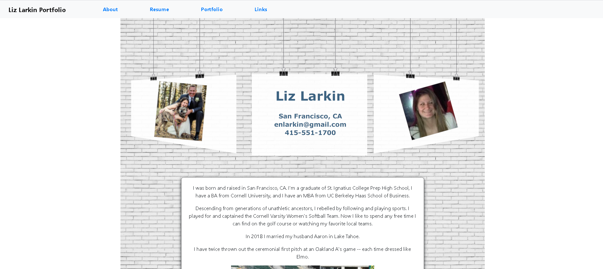

# Professional React Portfolio
A remake of my professional portfolio using React.

## Installation:
This project uses React, Bootstrap, and react-router-dom library.   

## Usage:
An app to showcase personal information and other applications/projects. 

## Contributing:
This project is open to contributions.

## To Do:
* Further styling 
* Add additional projects are they're complete to expand portfolio

## License:
MIT License: A short and simple permissive license with conditions only requiring preservation of copyright and license notices. Licensed works, modifications, and larger works may be distributed under different terms and without source code. License descriptions provided by [Choose A License]https://choosealicense.com/)

## Questions:
* GitHub Username: lizlarkin
* lizlarkin GitHub Link
* Email me with addition questions at: enlarkin@gmail.com

## Link to the deployed page
:https://larkin-burger.herokuapp.com/

## Screenshot: 

